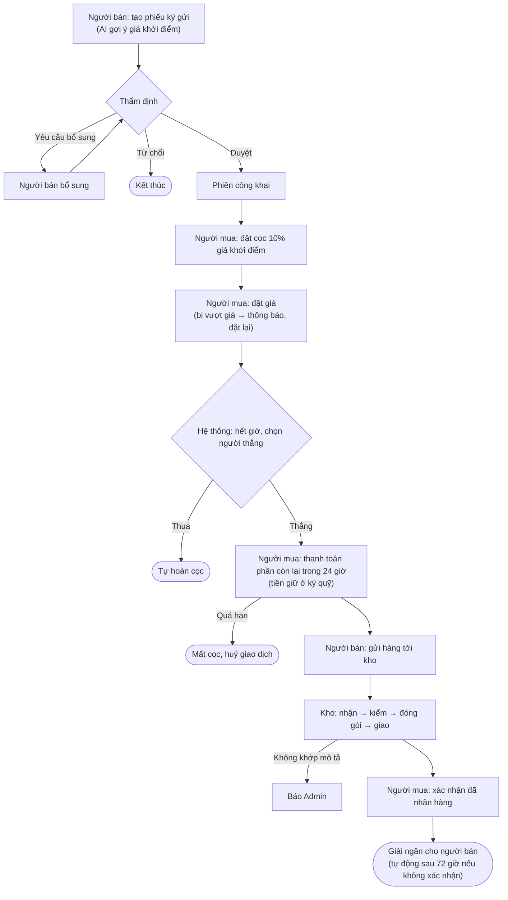

# BidVibe — Prototype (Flutter)

Prototype app đấu giá đồ cũ & đồ sưu tầm theo thời gian thực. Chạy hoàn toàn bằng **dữ liệu giả** trong bộ nhớ (`lib/store.dart`), chưa kết nối backend; tắt app là dữ liệu về lại ban đầu.

## Chạy

Yêu cầu Flutter stable **≥ 3.38** (cả nhóm dùng chung một bản để `pubspec.lock` không bị đổi qua lại).

```bash
flutter pub get
flutter run      # máy ảo Android / LDPlayer / Chrome
flutter test     # test luồng chính + smoke test các màn
```

Mở app → **chọn vai trò** (Người mua, Người bán, Thẩm định, Kho vận, Admin). Muốn đổi vai trò: bấm **Đăng xuất** trên thanh DEMO rồi chọn lại.

## Main flow



| # | Vai trò | Việc | Màn hình | Hàm trong `AppStore` |
|---|---|---|---|---|
| 1 | Người bán | Tạo phiếu, dùng AI gợi ý giá | Tab **Tạo mới** · `seller/seller_create.dart` | `createListing` |
| 2 | Thẩm định | Duyệt / yêu cầu bổ sung / từ chối | **Hàng chờ** → `appraiser/appraiser_detail.dart` | `approveAppraisal`, `requestMoreInfo`, `rejectAppraisal` |
| 3 | Người mua | Đặt cọc, đặt giá | **Khám phá** → `bidder/bidder_detail.dart` | `joinAuction`, `placeBid` |
| 4 | Hệ thống | Hết giờ: chọn người thắng, hoàn cọc người thua | — (tick mỗi giây) | `_closeAuction` |
| 5 | Người mua | Thanh toán phần còn lại | `bidder/bidder_payment.dart` | `payForAuction` |
| 6 | Người bán | Gửi hàng tới kho | Tab **Gửi kho** · `seller/seller_shipping.dart` | `sellerMarkShipped` |
| 7 | Kho vận | Nhận, kiểm, đóng gói, giao | `warehouse/warehouse_board.dart` → `warehouse_detail.dart` | `whConfirmReceive`, `whConfirmInspect`, `whMarkPacked`, `whMarkShipped`, `whMarkDelivered` |
| 8 | Người mua | Xác nhận đã nhận → giải ngân | `bidder/bidder_done.dart` | `confirmDelivery` |

Chuỗi trên được kiểm tra trong `test/store_flow_test.dart` (nhóm **Luồng chính**), gồm cả test đi trọn một món hàng mới từ lúc tạo tới lúc giải ngân.

**Luồng phụ (Admin):** phiên bị gắn cờ kèm AI giải thích → tạm dừng / chấm dứt khẩn cấp (tab **Cờ**); tranh chấp → phán quyết hoàn tiền / giải ngân (tab **Tranh chấp**); báo cáo tài chính kèm AI tóm tắt (tab **Báo cáo**). Người mua/bán có chatbot hỗ trợ và mở tranh chấp (`customer/`).

### Demo nhanh, không phải chờ

Trong màn chi tiết phiên/đơn có khung **DEMO**:

- **Còn 10 giây** — rút thời gian phiên còn 10 giây và dừng bot, để người demo chắc thắng.
- **Mô phỏng bị vượt giá** — ép một lượt đặt giá đối thủ.
- **Mô phỏng quá hạn 24 giờ** — thử nhánh quá hạn thanh toán.
- **Mô phỏng quá 72 giờ** — thử tự động giải ngân.

## Dữ liệu giả

- Nằm trong `lib/store.dart` (`AppStore`), model ở `lib/models.dart`.
- Có sẵn: mỗi vai trò ≥ 3 tài khoản (mật khẩu `123456`), 10 phiên đấu giá (`a1`–`a10`) ở đủ trạng thái, hàng chờ thẩm định, đơn kho ở mọi trạng thái, phiên bị gắn cờ, tranh chấp.
- "Thời gian thực" giả lập bằng vòng tick mỗi giây: bot tự đặt giá, tự đóng phiên, hoàn cọc, xử lý quá hạn, tự giải ngân.
- AI (gợi ý giá, giải thích cờ, báo cáo, chatbot) trả nội dung soạn sẵn.
